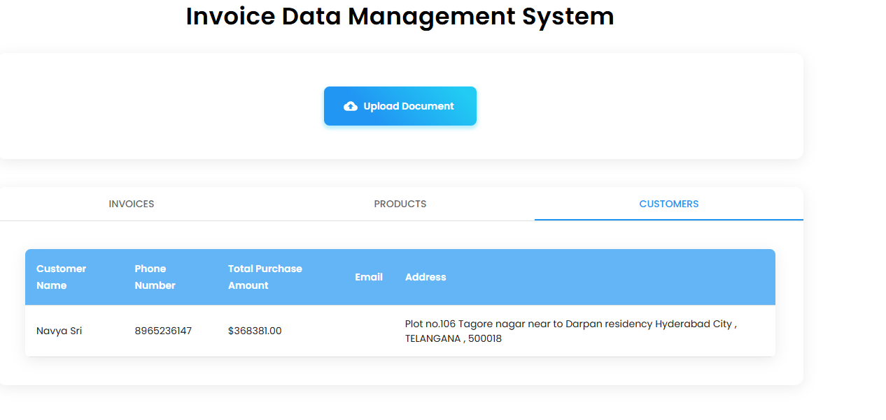

# DataWhiz 
**DataWhiz** is a versatile web application designed to simplify document data handling.

### Note  
We are currently using the free version of the Gemini API key, which may result in slower load times or occasional failures. For a smoother and more reliable experience, we recommend using a paid API key and running the application locally.

**Videos**

https://github.com/user-attachments/assets/f9ffd62e-4547-4d10-abb8-ac79e7a598c8


https://github.com/user-attachments/assets/9eab9b4a-d16c-452e-aef0-e124e8ee5722


**ScreenShots**




## 🚀 **Tech Stack**

- **React 18**: Frontend library for building dynamic user interfaces.
- **TypeScript**: Ensures robust and type-safe development.
- **Redux Toolkit**: Simplifies state management with efficient and maintainable code.
- **Material UI v6**: Provides modern, accessible UI components.
- **Google Gemini AI API**: Powers AI-driven data analysis and processing.
- **PDF.js**: Handles PDF rendering and processing.
- **Tesseract.js**: Performs OCR (Optical Character Recognition) for extracting text from images.
- **XLSX**: Enables seamless handling of Excel files.
- **Framer Motion**: Delivers smooth animations and transitions.

---

## 🛠 **Getting Started**

Follow these steps to set up and run the project locally:

### 1. **Clone the Repository**
```bash
git clone https://github.com/your-username/datawhiz.git
cd datawhiz
```

### 2. **Install Dependencies**
```bash
npm install
```

### 3. **Configure Environment Variables**
Create a `.env` file in the project root directory and add your Google Gemini API key:
```
REACT_APP_GEMINI_API_KEY=your-gemini-api-key
```

### 4. **Start the Development Server**
```bash
npm start
```
The app will be available at [http://localhost:3000](http://localhost:3000).

---


## 📄 **License**
This project is licensed under the [MIT License](LICENSE).

---

## 📧 **Contact**
If you have any questions or suggestions, feel free to reach out at **stayconnectedwithmanish@gmail.com**. 

Let’s make **DataWhiz** even better together! 🚀
